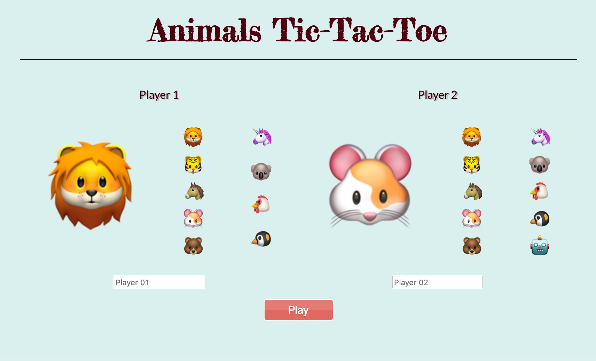
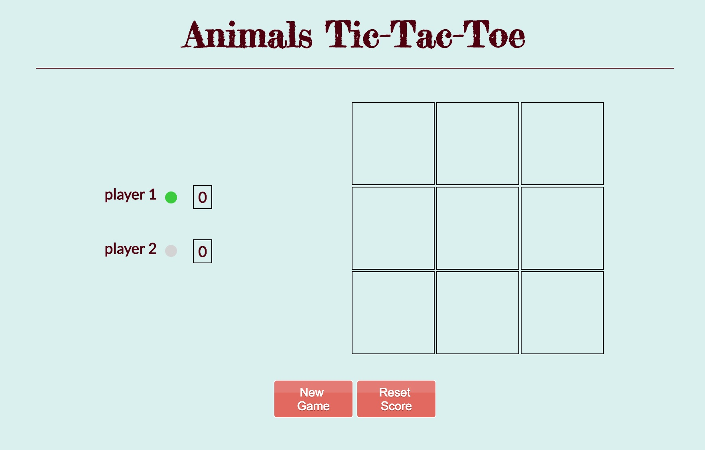

# Project 1: Tic Tac Toe
## overview 

In this project I built a Tic tac toe game using HTML,CSS, JavaScript and jQuery. 

***
***

## Landing Page

### Character Customisation 
Players get to pick their characters and change their names.

### option to play against the AI
There is an option to play against the computer 

### Play button 
Then finally, there is the play button. It will direct players to the game. 

***

## Game Page 

### The Game
Players play with their picked characters. first player to play three in a rwo wins.

### Finding The Winner:
in order to find the winner, my game check every row after each click. then alert for the winner, add 1 to the winner score and block any further clicks on the board.

### New Game Button
clearing all blocks. resetting all game variables.

### Reset Score button
it does what new game button does + it clears the score.

### The Ai:
The Ai coded to react in the three different stages.
#### After the opponent's first move
#### After the opponent's second move
#### After its second move

***

## Unsolved Problems 
Game can't detecting early draws, draws only detected when the board in full and there is no winner.

## Future Improvement 
To make the game detects early draws.
Add online multiplayer mode.
build a responsive design.

***

## Acknowledgments
⋅⋅* [Sweetalert](https://sweetalert.js.org)
⋅⋅* [AnimateIt](https://daneden.github.io/animate.css/)

